# YurongOS 雨融系统

## 简介

YurongOS（雨融系统）是一个运行于 x86-64 平台的玩具级操作系统，使用 C++ 和汇编编写，纯 64 位模式，用很新的工具链构建。

系统的设计与实现参考以下项目：

* 同济大学计算机系《操作系统》课程教学实验系统 Unix V6++ OOS
* 踌躇月光操作系统课程实验系统 onix

主要在以下材料的帮助下推进：

* OSDev 网站
* 同济大学《操作系统原理》

特别感谢：

* 张H同学
* 方Y老师
* 邓R老师
* 沈J老师

实现计划（别骂了，确实还差很多没做呢）：

* [X] 启动引导（含基本分页）
* [X] 内存检测（获取基本信息）
* [X] 文本显示驱动
* [X] 通用开发库
* [X] 中断结构准备
* [X] 内存检测（处理）
* [X] 内核区分页
* [X] 中断完善
* [X] 内核堆内存管理
* [X] 用户区分页
* [ ] 文件系统（设计）
* [ ] 文件系统（外置编辑器）
* [ ] 高速缓存
* [ ] 文件系统（内核）
* [ ] ELF 解析
* [ ] 系统调用
* [X] 进程模型
* [ ] 进程运行时环境
* [ ] Shell

## 参考开发环境

这里列出一个参考环境。其他环境的开发体验不做保证。

> OS: Arch Linux
>
> Kernel: GNU/Linux 6.1.4
>
> Graphics: X11
>
> GCC: 12.2.0
>
> NASM: 2.15.05
>
> GNU Make: 4.3

## 推荐配置（虚拟机配置）

| 参数 |    最低配置    |    舒适配置    |
| :--: | :------------: | :------------: |
| CPU | Skylake Server | Icelake Server |
| 内存 |      32MB      |      8GB      |
| 硬盘 |      32MB      |     256MB     |

## 经过测试的虚拟机运行环境

|            主机环境            |             虚拟化平台             |     虚拟化平台备注     |    芯片设置    | 内存大小 |
| :-----------------------------: | :--------------------------------: | :--------------------: | :------------: | :------: |
| Arch Linux (Linux 6.1.8) amd64 |      Qemu System X86_64 7.2.0      |                        | Icelake-Server |   8GB   |
| Arch Linux (Linux 6.1.8) amd64 |             Bochs 2.7             | 自行编译，启用64位支持 | 启用 1gb_page |  128MB  |
|      Windows 11 Pro amd64      | VMware® Workstation 17 Pro 17.0.0 |                        |                |   12GB   |

## 系统盘布局

|  盘块号  | 大小  |        用途        |
| :-------: | ----- | :-----------------: |
|     0     | 512B  |      启动引导      |
|     1     | 512B  | 文件系统 SuperBlock |
|  [2, 3]  | 1KB   |  long mode 加载器  |
| [4, 1999] | 998KB |  kernel 二进制文件  |
|          |       |        待定        |

## 进程核心栈设计

## 物理内存布局

使用平铺模型（flat model），即描述符内注明的内存基地址就是 0，不做奇怪的变换。

地址使用16进制书写（带单位的除外）。

### 启动时

|     起始地址     |     终止地址（含）     |                       大小                       |                              用途和备注                              |
| :--------------: | :--------------------: | :----------------------------------------------: | :------------------------------------------------------------------: |
|       500       |          503          |                        4B                        |                         内存检测 ards count                         |
|       504       |          507          |                        4B                        |                                  空                                  |
|       508       |          81F          | 792B 每结构24字节 强制限制最高33个结构 |                         内存检测 ards buffer                         |
|       1000       |          1FFF          |                       4KB                       |                           四级页表（PML4）                           |
|       2000       |          2FFF          |                       4KB                       |                         内核静态区页表 PML3                         |
|       3000       |          3FFF          |                       4KB                       |                         内核静态区页表 PML2                         |
|       4000       |          4FFF          |                       4KB                       |                           核心栈页表 PML3                           |
|       5000       |          5FFF          |                       4KB                       |                           核心栈页表 PML2                           |
|       6000       |          77FF          |                       6KB                       |                        启动引导过程暂用运行栈                        |
|       7800       |          7BFF          |                       1KB                       |                       启动引导程序：二级启动器                       |
|       7C00       |          7DFF          |                       512B                       |                       启动引导程序：一级启动器                       |
|       8000       |         47FFF         |                      256KB                      |                            物理映射 PML3                            |
|      48000      |         49FFF         |                       8KB                       |                    空闲内存管理器的前2个页链节点                    |
|      9D000      |         9DFFF         |                       4KB                       |                            前2M映射 PML3                            |
|      9E000      |         9EFFF         |                       4KB                       |                            前2M映射 PML2                            |
| 10 0000 1MB | 7F FFFF 8MB - 1B |                       7MB                       | 系统内核静态数据 （注：需在启动引导程序 编辑实际加载大小） |
| 80 0000 8MB | EF FFFF 14MB - 1B |                       6MB                       |                                核心栈                                |

## 内存映射

采用高位内核设计。

用户区：\[0x 0000 0000 0000 0000, 0x 0000 7FFF FFFF FFFF)

内核区：\[0x FFFF 8000 0000 0000, 0x FFFF FFFF FFFF FFFF\)

各 128TB。

### 用户区（Ring 3）

| 起始地址 |                结束地址（含）                | 大小 | 物理起始地址 | 用途和备注 |
| :------: | :------------------------------------------: | :--: | :----------: | :--------: |
|          | 7FFF FFFF FFFF \(8000 0000 0000 \- 1\) |      |      \/      |   用户栈   |

### 内核区（Ring 0）

|                     起始地址                     |             结束地址（含）             | 大小 | 物理起始地址 |            用途和备注            |
| :----------------------------------------------: | :-------------------------------------: | :--: | :----------: | :------------------------------: |
| FFFF A000 0000 0000 160TB 320, 0, 0, 0 | FFFF A000 007F FFFF 320, 0, 3, 511 | 8MB |   00 0000   | 1M 以下区域 和 系统内核静态 |
|    FFFF BFFF FFA0 0000 191T+1023G+1018M    |           FFFF BFFF FFFF FFFF           | 6MB |   80 0000   |              核心栈              |
|          FFFF C000 0000 0000 192TB          |           FFFF DFFF FFFF FFFF           | 32TB |   00 0000   |           物理内存映射           |
